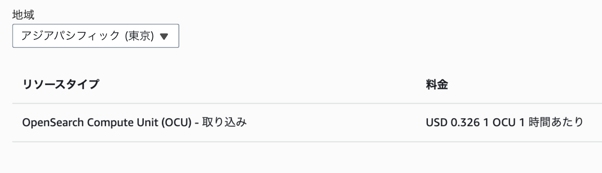
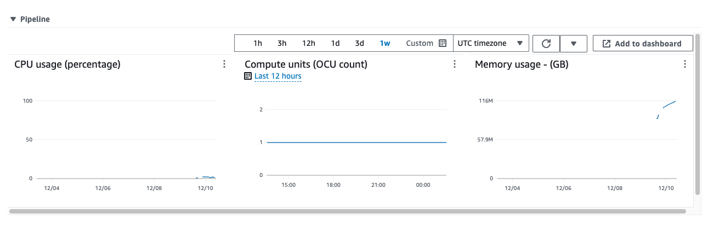

# Amazon DynamoDB zero-ETL integration with Amazon OpenSearch Serviceについて

やまたつ
2023-12-11

---

<dev style="display: flex; justify-content: center; align-items: center; margin-top: 40px;">
  
  <ul style="list-style-type: none; line-height: 1.4">
    <li style="font-size: 56px; font-weight: 700;">山本達也（やまたつ）</li>
    <li style="font-size: 32px; margin-bottom: 0px;">クラスメソッド株式会社</li>
    <li style="font-size: 32px; margin-bottom: 16px;">CX事業本部 デリバリー部</li>
    <li style="font-size: 24px; margin-bottom: 0px;">
      <a href="https://twitter.com/yamatatsu193">Twitter: @yamatatsu193</a>
    </li>
    <li style="font-size: 24px; margin-bottom: 16px;">
      <a href="https://github.com/yamatatsu">GitHub: @yamatatsu</a>
    </li>
  </ul>
</dev>

---

Amazon DynamoDB zero-ETL integration with Amazon OpenSearch Service とは？🤔

---

公式ブログ

<iframe class="hatenablogcard" style="width:100%;height:155px;max-width:680px;" title="Amazon DynamoDB の Amazon OpenSearch Service とのゼロ ETL 統合が利用可能になりました | Amazon Web Services ブログ" src="https://hatenablog-parts.com/embed?url=https://aws.amazon.com/jp/blogs/news/amazon-dynamodb-zero-etl-integration-with-amazon-opensearch-service-is-now-generally-available/" width="300" height="150" frameborder="0" scrolling="no"></iframe>

---

やってみた

---

DevelopersIOブログ

<iframe class="hatenablogcard" style="width:100%;height:155px;max-width:680px;" title="Amazon DynamoDB zero-ETL integration with Amazon OpenSearch Service をCDKで書いてみた | DevelopersIO" src="https://hatenablog-parts.com/embed?url=https://dev.classmethod.jp/articles/dynamodb-to-opensearch-cdk/" width="300" height="150" frameborder="0" scrolling="no"></iframe>

---

それで何が幸せなの？🤔

---

DynamoDBの検索性を補うために、OpenSearch Serviceを使うパターンが簡単になる

<iframe class="hatenablogcard" style="width:100%;height:155px;max-width:680px;" title="Indexing Amazon DynamoDB Content with Amazon Elasticsearch Service Using AWS Lambda | AWS Compute Blog" src="https://hatenablog-parts.com/embed?url=https://aws.amazon.com/jp/blogs/compute/indexing-amazon-dynamodb-content-with-amazon-elasticsearch-service-using-aws-lambda/" width="300" height="150" frameborder="0" scrolling="no"></iframe>

---

OpenSearch Serviceでは何ができるのか？🤔

---

- すべてのフィールドを検索対象にできる
- 全文検索
- SQL(joinもつかえる)
- データの集計（移動平均、累積など）
- アラート設定
- 異常検知
- Vector Search

---

気になるお値段 💰

---

2023/12/11時点

---

OCU消費

---

S3からのzero-ETLも気になる。。。

<iframe class="hatenablogcard" style="width:100%;height:155px;max-width:680px;" title="Amazon OpenSearch Service の Amazon S3 とのゼロ ETL 統合 (プレビュー) を発表 | AWS ニュースブログ" src="https://hatenablog-parts.com/embed?url=https://aws.amazon.com/jp/blogs/aws/amazon-opensearch-service-zero-etl-integration-with-amazon-s3-preview/" width="300" height="150" frameborder="0" scrolling="no"></iframe>

---

DynamoDBのvector searchも気になる。

---

ご清聴ありがとうございました🙇‍♂️
